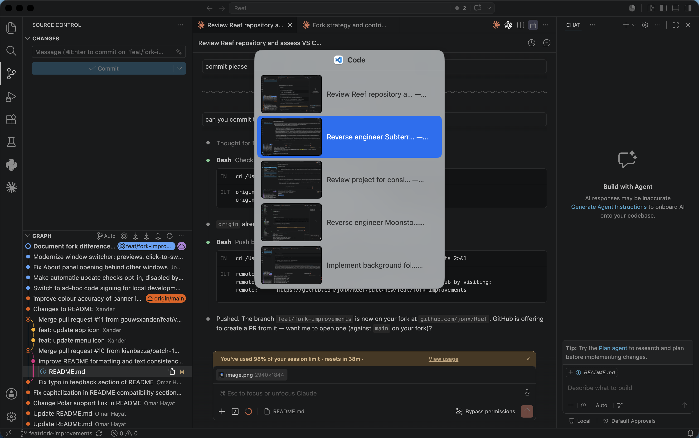

# ReefJKN

A personal fork of [Reef](https://github.com/gouwsxander/Reef) by Xander Gouws — the macOS window manager that gives every app its own Alt-Tab.

Requires macOS 14.6+

## What's different in this fork

This fork builds on [gouwsxander/Reef](https://github.com/gouwsxander/Reef) with a focus on a more modern switcher and a friendlier permission experience:

- **Window previews** — the switcher can show a live snapshot of each window (like the screenshot above). This is optional and requires Screen Recording access; ReefJKN only takes still snapshots, never video or audio. Without the grant, the switcher falls back to a compact text-only list.
- **Modernized switcher panel** — native system material that follows Light/Dark mode, menu-style selection highlight, app icon in the header, tighter layout.
- **Click to switch** — entries in the switcher are clickable; the keyboard-only flow still works as before.
- **Gentler permission handling** — if Accessibility access is missing, the switcher says so and takes you straight to the right System Settings pane instead of failing silently. Window previews are suggested once via a small dismissible hint, never a system dialog.
- **No update checks by default** — automatic update checks are opt-in (Preferences → General). Manual "Check for updates…" always works.
- **Small fixes** — the About panel opens in front instead of behind other windows.

## Key Features

ReefJKN lets you bind applications to number keys and cycle through their windows with an Alt-Tab-like interface.

- Bind applications to number keys to refocus to **any** window for that app
- Assign profiles for different sets of bindings
- Do your binding and profile management through the keyboard
- Customizable keyboard shortcuts

## Usage

### Binding
You should start by binding different applications to the number keys. You can do this:
- through **Preferences → Profiles** (accessed through the menu bar), or
- by selecting the application of your choice and then pressing <kbd>Ctrl</kbd> + <kbd>Option</kbd> + <kbd>Shift</kbd>.

### Profiles
You can also set your bindings up in different profiles.

For example, you may want two profiles:
- "Coding": Which binds your favourite editor, browser, and terminal
- "Browsing": Which binds your favourite web browser, messaging app, and music client

You can switch between profiles:
- using the menu bar, or
- by binding them to the number keys, and then pressing <kbd>Ctrl</kbd> + <kbd>Option</kbd> + <kbd>[0-9]</kbd>.

### Switching applications
Suppose you're in your coding profile, and have your editor bound to `0`.

To switch between apps and windows:
1. Hold <kbd>Control</kbd> and press <kbd>0</kbd> to open a panel showing each of your editor's windows.
2. Press <kbd>0</kbd> multiple times to select the specific window you want.
3. Release <kbd>Control</kbd> to switch to the selected window.

In this way, ReefJKN gives every app its own 'Alt-Tab'.

Note that window switching is scoped to your current [macOS space](https://support.apple.com/en-ca/guide/mac-help/mh14112/mac).

### Customization

You can customize the modifiers for switching applications and profiles, and for binding different applications in **Preferences → Shortcuts**.

ReefJKN also pairs well with [Rectangle](https://github.com/rxhanson/Rectangle):
- Rectangle positions & re-arranges your windows
- ReefJKN re-focuses your windows

## Installation

Clone the repo and build with Xcode.

## Development

Issues and feedback via the [GitHub issues page](https://github.com/jonx/ReefJKN/issues).

## Credits

Based on [Reef](https://github.com/gouwsxander/Reef) by [Xander Gouws](https://github.com/gouwsxander). All original work and architecture is theirs. This fork's additions are free to use or pull back upstream.

## FAQ

<b>Why is it called "Reef"?</b>

 
The name comes from the starting sounds of the words "refocus" and "reframe". And, like a coral reef supports a diverse ecosystem, Reef supports your workspace—helping you navigate between windows quickly and easily.

## Related Projects
- [yabai](https://github.com/asmvik/yabai)
- [Aerospace](https://github.com/nikitabobko/AeroSpace?tab=readme-ov-file)
- [Rectangle](https://github.com/rxhanson/Rectangle)
- [AltTab for macOS](https://github.com/lwouis/alt-tab-macos/tree/master)
